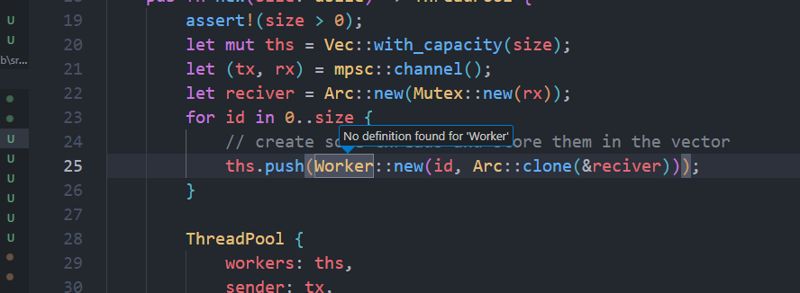

# 在normal模式下使用gd无法跳转到定义
报错如图：

## 解决方法：
vim的跳转定义功能，实际上用的就是vscode原生的跳转定义能力，所以大概率是我vscode本身就无法跳转定义。于是按照这个逻辑往下排查发现：我打开的vscode的窗口，工作台里有两个项目，分别有一个Cargo.toml，如果我在另外一个项目里面跳转，就可以正常跳转。
所以我另外打开了一个工作台，里面只包含了我关注的项目，就可以正常进行符号解析和跳转了。